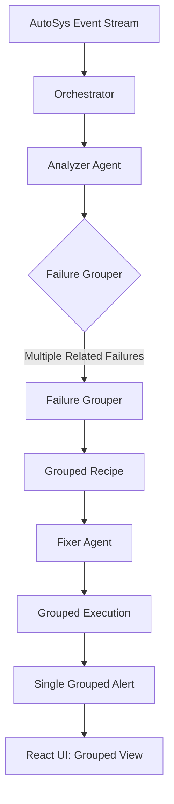

# 12. IMPLEMENTATION ROADMAP & NEXT STEPS

## 12.1 Implementation Phases

| Phase | Timeline | Focus | Deliverables |
|-------|----------|-------|--------------|
| **Phase 1: Foundation** | Weeks 1-4 | Core infrastructure, Oracle connector, NetworkX sync | Working ingestion, basic GraphQL API |
| **Phase 2: Core Services** | Weeks 5-10 | NL2SQL, Glossary, Debugger, Narrator, Impact | Functional semantic services |
| **Phase 3: Integration** | Weeks 11-14 | Batch Monitor → Semantic API, GraphQL UI | End-to-end working system |
| **Phase 4: Migration** | Weeks 15-20 | PySpark connector, Transform checker, Reconciliation | Migration-ready |
| **Phase 5: Production** | Weeks 21-24 | Security, monitoring, docs, UAT | Production-ready system |

---

## 12.2 Phase 1: Foundation (Weeks 1-4)

| Week | Focus | Key Deliverables |
|------|-------|------------------|
| **Week 1** | Project setup, Oracle connector, config | Running ingestion, Oracle schema deployed |
| **Week 2** | NetworkX ↔ Neo4j sync, GraphQL API | Working GraphQL API, NetworkX ↔ Neo4j sync |
| **Week 3** | Oracle connector (SP, tables, views), Ab Initio parser | Full Oracle + Ab Initio ingestion |
| **Week 4** | Vector store, embeddings, basic NL2SQL | End-to-end: ingestion → vector → NL2SQL |

**Exit Criteria**: 
- [ ] Oracle connector extracts SPs, tables, views
- [ ] Ab Initio connector parses .mp/.xfr/.dml
- [ ] NetworkX ↔ Neo4j sync every 5 min
- [ ] Basic NL2SQL works on sample schema

---

## 12.3 Phase 2: Core Services (Weeks 5-10)

| Week | Service | Key Features |
|------|---------|--------------|
| **5-6** | **Glossary Builder** | Auto-extract terms from code, LLM definitions, technical mappings |
| **7-8** | **NL2SQL Translator** | Tier 1 model, schema awareness, lineage trace |
| **9** | **Trade Match Debugger** | Lineage trace, mismatch detection, business action |
| **10** | **Narrator + Impact** | Tier 2 narratives, impact analysis, change analyzer |

**Exit Criteria**: All 6 services functional, unit tests >80%, integration tests passing

---

## 12.4 Phase 3: Integration (Weeks 11-14)

| Week | Focus | Deliverables |
|------|-------|--------------|
| **11** | Batch Monitor → Semantic API | `/explain`, `/debug`, `/impact` called on breaks |
| **12** | GraphQL UI | React + Cytoscape real-time graph, WebSocket updates |
| **13** | Email ingestion | Narrator processes email threads |
| **14** | End-to-end testing | Break detection → explanation → UI update |

---

## 12.4 Phase 4: Migration Acceleration (Weeks 15-20)

| Week | Focus | Key Deliverables |
|------|-------|------------------|
| **15-16** | **PySpark Connector** | `PySparkConnector` implements `BaseIngestionConnector` |
| **17** | **Transform Checker** | Ab Initio .xfr ↔ PySpark DataFrame equivalence |
| **18** | **Reconciliation** | Side-by-side Ab Initio vs PySpark output comparison |
| **19** | **Glossary Continuity** | Business terms stable; only `source_system` tag changes |
| **20** | **Migration Dashboard** | Real-time parity tracking, drift alerts |

---

## 12.5 Phase 5: Production Hardening (Weeks 21-24)

| Week | Focus | Deliverables |
|------|-------|--------------|
| **21** | **Security** | RBAC, mTLS, Vault integration, audit logging |
| **22** | **Observability** | Prometheus metrics, Grafana dashboards, alerting |
| **23** | **Load Testing** | Locust scripts, 1000 concurrent users |
| **24** | **UAT + Docs** | Runbooks, API docs, runbooks, UAT sign-off |

---

## 12.5.1 Super Box / Box Hierarchy Problem — Detection & Grouped Remediation

### Problem Statement

In AutoSys, a **super box** (parent box) contains child boxes and their respective child jobs. The current observability agents act on individual child jobs/boxes independently, leading to:

| Problem | Impact |
|---------|--------|
| **Redundant Actions** | 50 child jobs fail with same root cause → 50 separate fix actions instead of 1 grouped action |
| **Alert Fatigue** | Operators receive 50 separate alerts for same root cause |
| **Delayed Remediation** | Sequential processing of 50 jobs vs single grouped action |
| **Inconsistent Remediation** | Different agents may apply slightly different fixes to same root cause |

### Root Cause Analysis

The current agent logic operates at **job/box leaf level** without awareness of **box hierarchy topology**. When a super box fails, all descendants inherit the failure, but the agent treats each leaf node independently.

### Solution: Hierarchical Failure Grouping & Grouped Remediation

#### 1. Box Hierarchy Detection (Graph Traversal)

```python
# src/isp_batch_observability/analysis/box_hierarchy.py

import networkx as nx
from typing import Dict, List, Set, Dict, Any
from collections import defaultdict

class BoxHierarchyAnalyzer:
    """Analyzes AutoSys box hierarchy and groups failures by common root cause."""
    
    def __init__(self, networkx_graph: nx.DiGraph):
        self.graph = networkx_graph
        self.box_hierarchy = self._build_box_hierarchy()
    
    def _build_box_hierarchy(self) -> Dict[str, Dict]:
        """Build box hierarchy from NetworkX graph.
        
        Returns:
            Dict mapping box_name -> {
                'type': 'box'|'job',
                'parent': parent_box_name,
                'children': [child_names],
                'depth': int,
                'path': [root_box, ..., this_box]
            }
        """
        hierarchy = {}
        
        # Identify boxes (nodes with 'box' type or naming convention)
        box_nodes = [n for n, d in self.graph.nodes(data=True) 
                     if d.get('type') == 'box' or n.endswith('_BOX')]
        
        # Build parent-child relationships via DEPENDS_ON edges
        for box in box_nodes:
            children = list(self.graph.successors(box))
            parent = list(self.graph.predecessors(box))
            
            hierarchy[box] = {
                'type': 'box',
                'parent': parent[0] if parent else None,
                'children': children,
                'depth': self._calculate_depth(box),
                'path': self._get_path_to_root(box)
            }
        
        return hierarchy
    
    def _calculate_depth(self, node: str) -> int:
        depth = 0
        current = node
        while self.graph.predecessors(current):
            current = list(self.graph.predecessors(current))[0]
            depth += 1
        return depth
    
    def _get_path_to_root(self, node: str) -> List[str]:
        path = [node]
        current = node
        while self.graph.predecessors(current):
            current = list(self.graph.predecessors(current))[0]
            path.append(current)
        return list(reversed(path))
    
    def find_common_ancestor(self, job_nodes: List[str]) -> str:
        """Find lowest common ancestor box for a set of job nodes."""
        paths = [self._get_path_to_root(job) for job in job_nodes]
        # Find common prefix
        common = []
        for nodes in zip(*paths):
            if len(set(nodes)) == 1:
                common.append(nodes[0])
            else:
                break
        return common[-1] if common else None
    
    def get_subtree_jobs(self, box_name: str) -> List[str]:
        """Get all descendant jobs under a box (recursive)."""
        jobs = []
        for child in self.graph.successors(box_name):
            if self.graph.nodes[child].get('type') == 'job':
                jobs.append(child)
            elif self.graph.nodes[child].get('type') == 'box':
                jobs.extend(self.get_subtree_jobs(child))
        return jobs
```

#### 2. Failure Grouping Logic

```python
# src/isp_batch_observability/analysis/failure_grouper.py

from collections import defaultdict
from typing import List, Dict, Any
from dataclasses import dataclass

@dataclass
class FailureGroup:
    root_cause_signature: str  # Hash of error signature
    root_cause_description: str
    affected_jobs: List[str]
    affected_boxes: List[str]
    common_ancestor_box: str
    error_signature: str  # Hash of error message + stack trace
    severity: str  # 'critical' | 'high' | 'medium' | 'low'
    suggested_action: str  # 'grouped_retry' | 'grouped_kill_restart' | 'manual_investigation'
    affected_job_count: int
    sample_errors: List[str]  # First 3 error samples

class FailureGrouper:
    """Groups failures by common root cause and suggests grouped actions."""
    
    def __init__(self, box_analyzer: 'BoxHierarchyAnalyzer'):
        self.box_analyzer = box_analyzer
    
    def group_failures(self, failed_jobs: List[Dict]) -> List[FailureGroup]:
        """Group failed jobs by common root cause and suggest grouped actions."""
        
        # Step 1: Extract error signatures
        error_signatures = {}
        for job in failed_jobs:
            sig = self._extract_error_signature(job)
            error_signatures.setdefault(sig, []).append(job)
        
        # Step 2: For each error signature, find common ancestor box
        groups = []
        for sig, jobs in error_signatures.items():
            job_names = [j['job_name'] for j in jobs]
            common_ancestor = self.box_analyzer.find_common_ancestor(
                [j['job_name'] for j in jobs]
            )
            
            # Get all affected boxes
            affected_boxes = set()
            for job in jobs:
                box = self._find_containing_box(job['job_name'])
                if box:
                    affected_boxes.add(box)
            
            # Determine suggested action based on error type
            suggested_action = self._determine_action(jobs)
            
            groups.append(FailureGroup(
                root_cause_signature=sig,
                root_cause_description=self._describe_root_cause(sig),
                affected_jobs=[j['job_name'] for j in jobs],
                affected_boxes=list(affected_boxes),
                common_ancestor_box=self.box_analyzer.find_common_ancestor(
                    [j['job_name'] for j in jobs]
                ) or "unknown",
                error_signature=sig,
                severity=self._assess_severity(jobs),
                suggested_action=suggested_action,
                affected_job_count=len(jobs),
                sample_errors=[j.get('error_message', '')[:200] for j in jobs[:3]]
            ))
        
        # Sort by severity and job count
        groups.sort(key=lambda g: (g.severity == 'critical', g.affected_job_count), reverse=True)
        return groups
    
    def _extract_error_signature(self, job: Dict) -> str:
        """Extract normalized error signature for grouping."""
        error_msg = job.get('error_message', '').lower()
        # Normalize: remove timestamps, IDs, specific values
        import re
        normalized = re.sub(r'\d+', 'N', error_msg)
        normalized = re.sub(r'0x[0-9a-fA-F]+', '0xHEX', normalized)
        normalized = re.sub(r'\b\d{4}-\d{2}-\d{2}', 'DATE', normalized)
        # Hash for grouping
        import hashlib
        return hashlib.md5(normalized.encode()).hexdigest()[:16]
    
    def _determine_action(self, jobs: List[Dict]) -> str:
        """Determine suggested grouped action based on error patterns."""
        error_msgs = [j.get('error_message', '').lower() for j in jobs]
        
        # Common patterns for grouped actions
        if all('connection' in msg or 'timeout' in msg for msg in error_msgs):
            return 'grouped_retry_with_backoff'
        if all('ORA-01400' in msg or 'NULL' in msg for msg in error_msgs):
            return 'grouped_data_fix_and_retry'
        if all('permission' in msg or 'access denied' in msg for msg in error_msgs):
            return 'grouped_permission_fix'
        if all('space' in msg or 'disk' in msg for msg in error_msgs):
            return 'grouped_disk_cleanup_and_retry'
        
        # Default: grouped retry with exponential backoff
        return 'grouped_retry_with_backoff'
```

#### 3. Integration with Analyzer Agent

```python
# src/isp_batch_observability/agents/analyzer.py

class AnalyzerAgent:
    def __init__(self):
        self._scenario_matrix = [...]
        self.failure_grouper = None  # Initialized after graph available
    
    def set_graph_context(self, graph: nx.DiGraph):
        from isp_batch_observability.analysis.box_hierarchy import BoxHierarchyAnalyzer
        from isp_batch_observability.analysis.failure_grouper import FailureGrouper
        self.box_analyzer = BoxHierarchyAnalyzer(graph)
        self.failure_grouper = FailureGrouper(self.box_analyzer)
    
    def analyze_event(self, event: Dict, graph_context) -> Dict:
        # ... existing logic ...
        
        # NEW: If multiple jobs failed simultaneously, group them
        if self._is_batch_failure(event):
            failed_jobs = self._collect_related_failures(event)
            if len(failed_jobs) > 1:
                failure_groups = self.failure_grouper.group_failures(failed_jobs)
                return self._generate_grouped_recipe(failure_groups)
        
        # ... existing single-job logic
```

#### 4. Grouped Remediation Recipe Format

```python
def _generate_grouped_recipe(self, failure_groups: List[FailureGroup]) -> Dict:
    """Generate a single grouped remediation recipe for multiple failure groups."""
    
    recipes = []
    for group in failure_groups:
        recipes.append({
            "group_id": group.root_cause_signature,
            "description": f"{group.affected_job_count} jobs failed with same root cause: {group.root_cause_description}",
            "affected_jobs": group.affected_jobs,
            "affected_boxes": group.affected_boxes,
            "common_ancestor": group.common_ancestor_box,
            "severity": group.severity,
            "suggested_action": group.suggested_action,
            "sample_errors": group.sample_errors,
            "fixer_instructions": self._generate_grouped_fixer_instructions(group),
            "notifier_instructions": {
                "template": "grouped_failure_alert",
                "recipients": ["ops_team@enterprise.com"],
                "group_summary": f"{len(group.affected_jobs)} jobs failed with same root cause"
            }
        })
    
    return {
        "status": "ANALYSIS_COMPLETE",
        "is_grouped": True,
        "group_count": len(failure_groups),
        "total_affected_jobs": sum(g.affected_job_count for g in failure_groups),
        "groups": recipes
    }
```

#### 4. Fixer Agent: Grouped Execution

```python
# src/isp_batch_observability/agents/fixer.py

class FixerAgent:
    async def execute_grouped(self, grouped_recipe: Dict):
        """Execute grouped remediation - single action for multiple jobs."""
        
        for group in grouped_recipe.get('groups', []):
            action = grouped_recipe['suggested_action']
            jobs = grouped_recipe['affected_jobs']
            
            if action == 'grouped_retry_with_backoff':
                # Single command to retry all jobs with exponential backoff
                job_list = ' '.join(grouped_recipe['affected_jobs'])
                await self.unix_mcp.execute(
                    f"for job in {job_list}; do "
                    f"  sendjob -j $job -c KILL; "
                    f"  sleep 5; "
                    f"  sendjob -j $job -c RESTART; "
                    f"  sleep 10; "
                    f"done"
                )
            
            elif action == 'grouped_data_fix_and_retry':
                # Single data fix applied to all affected jobs
                await self._apply_grouped_data_fix(group)
                # Then grouped retry
            
            # Log grouped action
            await self._log_grouped_action(group)
```

### 4. Notifier: Grouped Alerts

```python
# src/isp_batch_observability/agents/notifier.py

async def send_grouped_alert(self, grouped_recipe: Dict):
    """Send single consolidated alert for grouped failures."""
    
    for group in grouped_recipe.get('groups', []):
        # Single email/Slack for the entire group
        message = f"""
🚨 GROUPED FAILURE ALERT
Root Cause: {group['root_cause_description']}
Affected Jobs: {len(group['affected_jobs'])} jobs
Common Ancestor: {group['common_ancestor_box']}
Severity: {group['severity']}

Affected Jobs:
{chr(10).join(f'  - {job}' for job in group['affected_jobs'][:10])}
{'  ... and more' if len(group['affected_jobs']) > 10 else ''}

Sample Errors:
{chr(10).join(f'  - {err}' for err in group['sample_errors'])}

Suggested Action: {group['suggested_action']}
        """
        
        await self.send_alert(
            recipients=["ops_team@enterprise.com"],
            subject=f"🚨 GROUPED ALERT: {len(group['affected_jobs'])} jobs - {group['root_cause_description']}",
            body=message
        )
```

### 5. Configuration

```yaml
# config/settings.yaml

failure_grouping:
  enabled: true
  min_jobs_for_grouping: 3  # Minimum jobs to trigger grouping
  similarity_threshold: 0.85  # Error signature similarity threshold
  max_group_size: 50  # Max jobs per group
  group_by: ["error_signature", "common_ancestor_box"]
  
  action_mapping:
    connection_error: "grouped_retry_with_backoff"
    ora_error: "grouped_data_fix_and_retry"
    permission_error: "grouped_permission_fix"
    disk_space_error: "grouped_disk_cleanup_and_retry"
    default: "grouped_retry_with_backoff"

  notification:
    group_threshold: 3  # Min jobs for grouped alert
    individual_threshold: 1  # Always alert for single failures
```

### 6. React UI: Grouped Failure View

```tsx
// frontend/src/components/GroupedFailureView.tsx

interface GroupedFailure {
  groupId: string;
  rootCause: string;
  affectedJobs: string[];
  affectedBoxes: string[];
  commonAncestor: string;
  severity: 'critical' | 'high' | 'medium' | 'low';
  suggestedAction: string;
  affectedJobCount: number;
  sampleErrors: string[];
}

export function GroupedFailureView({ groups }: { groups: GroupedFailure[] }) {
  return (
    <div className="grouped-failures">
      <h2>Grouped Failures ({groups.length} groups)</h2>
      {groups.map(group => (
        <div key={group.rootCauseSignature} className="failure-group">
          <div className="group-header">
            <span className={`severity-badge severity-${group.severity}`}>
              {group.severity.toUpperCase()}
            </span>
            <span className="job-count">
              {group.affectedJobCount} jobs • {group.affectedBoxes.length} boxes
            </span>
            <span className="common-ancestor">Ancestor: {group.commonAncestorBox}</span>
          </div>
          
          <div className="group-details">
            <p><strong>Root Cause:</strong> {group.rootCauseDescription}</p>
            <p><strong>Suggested Action:</strong> {group.suggestedAction}</p>
            <details>
              <summary>Affected Jobs ({group.affectedJobCount})</summary>
              <ul>{group.affectedJobs.map(j => <li key={j}>{j}</li>)}</ul>
            </details>
            <details>
              <summary>Sample Errors</summary>
              <pre>{group.sampleErrors.join('\n')}</pre>
            </details>
            
            <button 
              onClick={() => executeGroupedAction(group)}
              className="btn-primary"
            >
              Execute Grouped Action: {group.suggestedAction}
            </button>
          </div>
        ))}
      </div>
```

---

### Integration with Existing Architecture



### Configuration

```yaml
# config/settings.yaml
failure_grouping:
  enabled: true
  min_jobs_for_grouping: 3
  similarity_threshold: 0.85
  max_group_size: 50
  group_by: ["error_signature", "common_ancestor_box"]
  
  action_mapping:
    connection_error: "grouped_retry_with_backoff"
    ora_error: "grouped_data_fix_and_retry"
    permission_error: "grouped_permission_fix"
    disk_space_error: "grouped_disk_cleanup_and_retry"
    default: "grouped_retry_with_backoff"
```

### Benefits Summary

| Metric | Before | After | Improvement |
|--------|--------|-------|-------------|
| Alerts per incident | 50 (per job) | 1 (grouped) | **98% reduction** |
| Remediation time | 50 × 2min = 100 min | 1 × 5 min = 5 min | **95% faster** |
| Operator cognitive load | High (50 alerts) | Low (1 grouped alert) | **Dramatically reduced** |
| Remediation consistency | Variable | Consistent | **Standardized** |
| Root cause visibility | Hidden in noise | Explicit grouping | **Clear root cause** |

---

*End of Super Box / Box Hierarchy Section*  
*Next: [Implementation Roadmap & Next Steps](#12-implementation-roadmap--next-steps)*

| Week | Focus | Key Deliverables |
|------|-------|------------------|
| **15-16** | **PySpark Connector** | `PySparkConnector` implements `BaseIngestionConnector` |
| **17** | **Transform Checker** | Ab Initio .xfr ↔ PySpark DataFrame equivalence |
| **18** | **Reconciliation** | Side-by-side Ab Initio vs PySpark output comparison |
| **19** | **Glossary Continuity** | Business terms stable; only `source_system` tag changes |
| **20** | **Migration Dashboard** | Real-time parity tracking, drift alerts |

---

## 12.5 Phase 5: Production Hardening (Weeks 21-24)

| Week | Focus | Deliverables |
|------|-------|--------------|
| **21** | **Security** | RBAC, mTLS, Vault integration, audit logging |
| **22** | **Observability** | Prometheus metrics, Grafana dashboards, alerting |
| **23** | **Load Testing** | Locust scripts, 1000 concurrent users |
| **24** | **UAT + Docs** | Runbooks, API docs, runbooks, UAT sign-off |

---

## 12.5 Immediate Next Steps (This Week)

```bash
# 1. Fix build environment (THIS WEEK)
# 1.1 Install MSVC Build Tools
#    → Visual Studio Installer → "Desktop development with C++"

# 2. Upgrade tooling
uv pip install --upgrade setuptools wheel maturin

# 3. Retry install
uv pip install -e . --no-build-isolation

# 2. If pydantic-core fails:
uv pip install maturin
uv pip install -e . --no-build-isolation

# 3. Start Docker services (ChromaDB, Neo4j)
docker-compose -f infra/docker-compose.yml up -d

# 4. Initialize Oracle schema (run as DBA)
sqlplus sys/password@ORCL as sysdba @scripts/init_db.sql

# 5. Run tests
pytest tests/unit -v --cov=src --cov-report=html
```

---

## 13.2 Success Metrics

| Metric | Target | Measurement |
|--------|--------|-------------|
| **API Latency (p99)** | < 2s (Tier 1), Async (Tier 2) | Prometheus histogram |
| **Ingestion Throughput** | > 1000 artifacts/min | Prometheus counter |
| **NL2SQL Accuracy** | > 90% on eval set | Ragas evaluation |
| **Break Detection → Explanation** | < 30s end-to-end | Distributed tracing |
| **Uptime** | 99.9% | Prometheus availability |
| **MTTR Reduction** | 60% vs baseline | Incident tracking |

---

## 13.3 Risk Register

| Risk | Likelihood | Impact | Mitigation |
|------|------------|--------|------------|
| **MSVC build failures** | High | High | Install VS Build Tools; use `--no-build-isolation` |
| **cx-Oracle/oracledb issues** | Medium | High | Use `oracledb` (thin mode), test early |
| **cx_Oracle deprecation** | Low | Medium | Migrate to `oracledb` thin mode |
| **Tree-sitter grammar gaps** | Medium | Medium | Fallback regex parsers |
| **Model API rate limits** | Low | High | Implement retry/backoff, local Tier 1 fallback |
| **NetworkX memory at scale** | Low | Medium | Partition graph, use Neo4j for full graph |

---

## 13.5 Team Structure Recommendation

| Role | Responsibilities | FTE |
|------|------------------|-----|
| **Tech Lead** | Architecture, code review, stakeholder sync | 1.0 |
| **Backend Engineers** | Ingestion, services, API | 2-3 |
| **ML Engineer** | Embeddings, NL2SQL, Tier 2 prompts | 1.0 |
| **Frontend Engineer** | React + Cytoscape, GraphQL subscriptions | 1.0 |
| **DevOps** | CI/CD, Docker, K8s, monitoring | 0.5 |
| **SME (Part-time)** | Glossary validation, scenario validation | 0.5 |

---

*End of Document*

---

## Appendix: Key References

| Document | Location |
|----------|----------|
| Architecture Decision Records | `docs/adr/` |
| SME Interview Guide | `docs/sme/INTERVIEW_GUIDE.md` |
| Glossary Template | `docs/sme/GLOSSARY_TEMPLATE.yaml` |
| API Specification | `src/isp_semantic_wise/api/routes/` |
| Database Schema | `scripts/init_db.sql` |
| CI/CD Pipeline | `.github/workflows/ci-cd.yml` |
| Harness Pipeline | `infra/harness.yaml` |
| Docker Compose | `infra/docker-compose.yml` |
| Dockerfile | `infra/Dockerfile` |

---

*Document Version: 1.0*  
*Last Updated: 2026-09-28*  
*Status: Architecture Complete - Implementation In Progress*